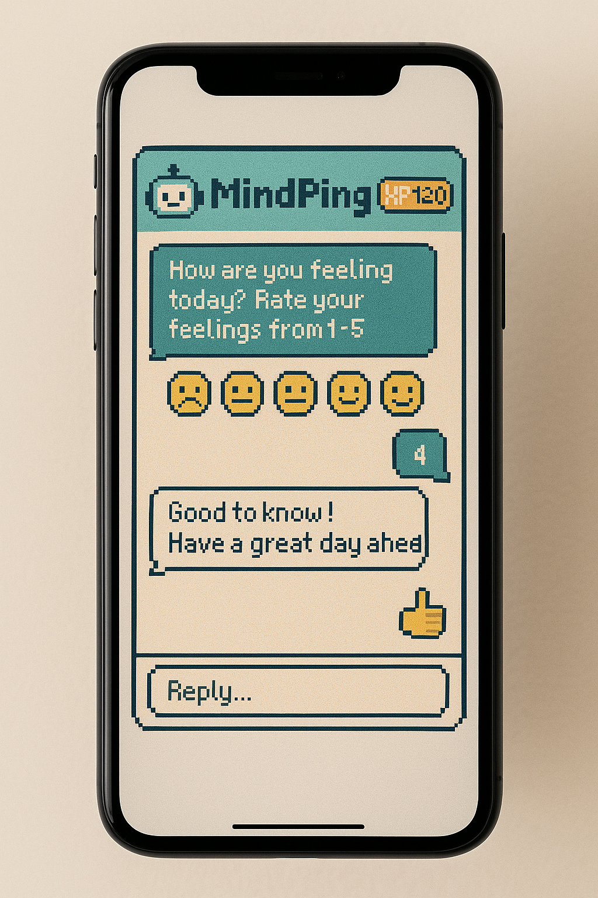
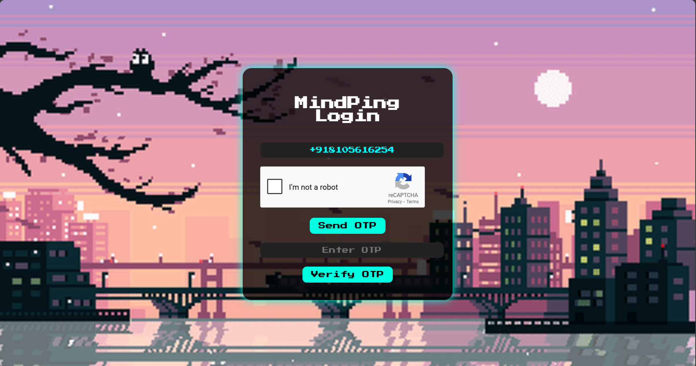

# 🧠 MindPing – Mental Wellness SMS Bot

**MindPing** is a mental wellness bot that interacts with users daily via SMS using Twilio 📲. It checks in on users’ moods, encourages consistent wellness tracking, and gamifies progress using XP points, AI feedback, and a stylish dashboard.


---

## 🔥 Features

- 📱 **SMS Check-ins** – Users receive a daily SMS asking, “How are you feeling today?”
- 🧑‍⚕️ **Mood Rating** – Users respond with a rating (1-5), and the bot replies with intelligent, supportive messages.
- 📊 **Gamified Progress** – Users earn XP based on consistency and response quality.
- 🤖 **AI Feedback** – Friendly, smart replies like “+20 XP! That was a good one!” 🎯
- 📈 **Dashboard** – Mood trends and XP progress shown in a beautiful pixel-themed web interface.
- 🛡️ **Distress Detection** – Detects alarming keywords and escalates if needed.

---

## 📸 Screens & UI Mockups

### 📲 Phone Interaction
Realistic view of MindPing SMS flow:

> 


---

### ✅ ReCaptcha and OTP Verified Login

> 

---

### 🎮 Pixel-Themed Dashboard Screen

> 

_Your mood trend over time_

---

### 💻 Web Dashboard on Laptop

> 

Visualizes mood as a line chart 📉 and shows earned XP 💥

---

## 🛠️ Tech Stack

- 🔧 **Backend:** Flask (Python)
- ☁️ **Deployment:** [Render](https://mindping.onrender.com)
- 📲 **Messaging API:** Twilio SMS
- 🔐 **Secure Environment:** `.env` + Twilio service account
- 🎨 **Frontend:** Pixel-themed CSS & Chart.js

---

## 🌐 Live Demo

**Check it out here 👉 [mindping.onrender.com](https://mindping.onrender.com)**

---

## 🚀 Getting Started

```bash
git clone https://github.com/yourusername/mindping.git
cd mindping

# Create virtual env & install dependencies
python -m venv env
source env/bin/activate
pip install -r requirements.txt

# Set up environment variables
cp .env.example .env  # then fill in your Twilio credentials

# Run the Flask app
flask run